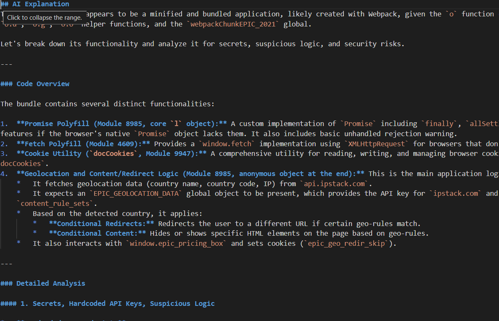

# JavaScript Security Analyzer with Gemini AI


A powerful tool for analyzing JavaScript files/URLs using Google's Gemini AI to detect security risks, hardcoded secrets, and suspicious patterns.

## 🔍 Tool Preview




## Features

- **AI-Powered Analysis**: Uses Gemini 2.5 Flash model to explain JavaScript code
- **Multi-Source Input**: Works with both local files and remote URLs
- **Security Scanning**: Detects:
  - Hardcoded API keys and secrets
  - Suspicious code patterns (eval, unsafe setTimeout)
  - Potential security vulnerabilities
- **Information Extraction**: Automatically extracts:
  - All URLs found in the code
  - Potential tokens/secrets
- **Parallel Processing**: Batch processing with configurable thread count
- **Beautiful Output**: Generates well-formatted Markdown reports

## Installation

1. Clone the repository:
   ```bash
   git clone https://github.com/yourusername/js-analyzer.git
   cd js-analyzer
2. Install dependencies:
   ```bash
   pip install -r requirements.txt
3. Add your Gemini API key in .env file:
   ```txt
   API_KEY=your_gemini_api_key_here  # Replace your own API KEY
4. Set up your Google Gemini API Key:
 
   Step 1: Access Google AI Studio
   Go to https://aistudio.google.com and sign in with your Google account.
 
   Step 2: Create API Key
   Click on the "Get API Key" button in the left sidebar

   Select "Create API Key in new project"

Your API key will appear - copy it immediately (it's only shown once!)

Important Notes:
1 Rate limit you can visit- https://ai.google.dev/gemini-api/docs/rate-limits 

## USAGE 
```bash
python jsanalyzer.py -i js_file.txt [-v] [-t 5]
```
## Example Input File
```text
https://example.com/script.js
local/path/to/file.js
another/script.js
```
## Performance Tips:

  For large numbers of files, increase thread count (up to 10) recommended use max. 50 js fiels for batter result (with 5 thread)
  
  Use -v flag to monitor progress
  
  The tool automatically skips invalid files/URLs

## Limitations:

  Gemini API has rate limits (consider implementing retry logic)
  
  Large files may hit token limits
  
  False positives/negatives possible in secret detection


